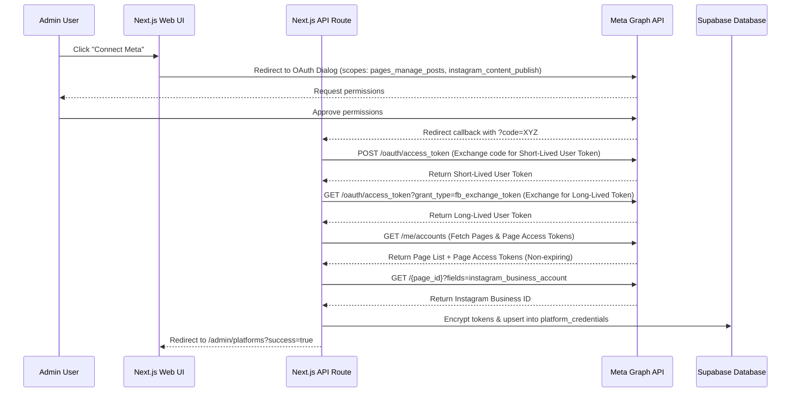

# Phase 5: Meta (Facebook & Instagram) API Integration

This document outlines the technical implementation plan for official Meta Graph API publishing (Tier A).

## 1. OAuth 2.0 Flow Design

Meta Graph API authorization uses standard OAuth 2.0. Because the platform runs locally/privately, we will use a Next.js API Route handler acting as the OAuth redirect endpoint.



### Required Meta Scopes
- `pages_manage_posts` (Facebook publishing)
- `pages_read_engagement`
- `pages_show_list` (Retrieve page credentials)
- `instagram_basic` (Read IG accounts details)
- `instagram_content_publish` (Instagram publishing)
- `public_profile`

---

## 2. Proposed Changes

### Component: Backend OAuth Routes

#### [NEW] [route.ts](file:///c:/Users/agmen/OneDrive/桌面/one2o/src/app/api/auth/meta/route.ts)
Route to redirect the user to the Meta OAuth dialog:
```typescript
import { NextResponse } from 'next/server';

export async function GET() {
  const appId = process.env.META_APP_ID;
  const redirectUri = `${process.env.NEXT_PUBLIC_APP_URL}/api/auth/callback/meta`;
  const scopes = [
    'pages_manage_posts',
    'pages_read_engagement',
    'pages_show_list',
    'instagram_basic',
    'instagram_content_publish',
    'public_profile'
  ].join(',');

  const url = `https://www.facebook.com/v19.0/dialog/oauth?client_id=${appId}&redirect_uri=${encodeURIComponent(redirectUri)}&scope=${encodeURIComponent(scopes)}&response_type=code`;
  
  return NextResponse.redirect(url);
}
```

#### [NEW] [route.ts](file:///c:/Users/agmen/OneDrive/桌面/one2o/src/app/api/auth/callback/meta/route.ts)
Callback route to handle token exchange, retrieve page info, and store credentials:
1. Exchange authorization code for User Token.
2. Exchange User Token for a **Long-Lived Page Access Token** (doesn't expire).
3. Fetch Meta Page ID and Instagram Business Account ID.
4. Encrypt the tokens using `EncryptionService` and upsert to `platform_credentials`.

---

### Component: Publishing Services

#### [NEW] [facebook-publisher.ts](file:///c:/Users/agmen/OneDrive/桌面/one2o/src/services/facebook-publisher.ts)
Class implementing `BasePublisher` using Meta Graph API:
- **Publish Flow:**
  - Retrieve Page Access Token and Page ID from `platform_credentials`.
  - If post has images/video, use `POST /v19.0/{page_id}/photos` or `POST /v19.0/{page_id}/videos`.
  - If text-only, use `POST /v19.0/{page_id}/feed`.

#### [NEW] [instagram-publisher.ts](file:///c:/Users/agmen/OneDrive/桌面/one2o/src/services/instagram-publisher.ts)
Class implementing `BasePublisher` using Meta Graph API:
- **Publish Flow:**
  - Retrieve Page Access Token and Instagram Business Account ID.
  - Create media container: `POST /v19.0/{instagram_business_account_id}/media` (with `image_url`/`video_url` & `caption`).
  - Poll status of container until ready.
  - Publish container: `POST /v19.0/{instagram_business_account_id}/media_publish` with the container ID.

---

### Component: Worker & UI Integration

#### [MODIFY] [processor-core.ts](file:///c:/Users/agmen/OneDrive/桌面/one2o/src/worker/processor-core.ts)
Map new publishers:
```typescript
import { FacebookPublisher } from '../services/facebook-publisher';
import { InstagramPublisher } from '../services/instagram-publisher';

const PUBLISHERS: Record<string, BasePublisher> = {
  // ... existing
  'facebook': new FacebookPublisher(),
  'instagram': new InstagramPublisher(),
};
```

#### [MODIFY] [page.tsx](file:///c:/Users/agmen/OneDrive/桌面/one2o/src/app/admin/platforms/page.tsx)
- Enable the "Tier A: Official APIs" UI card.
- Add a "Connect Facebook & Instagram" button linking to `/api/auth/meta`.
- Display connection status and sync dates.

---

## 3. Verification Plan

### Automated Tests
- Create unit tests verifying token encryption and payload extraction.
- Create mock tests simulating API failures (e.g. invalid tokens, rate limits).

### Manual Verification
1. Run `ngrok http 3000` to expose local Next.js server.
2. Configure Meta Developer Portal with the ngrok callback redirect URL.
3. Click "Connect Meta" in the Admin Panel and complete the authorization.
4. Verify `platform_credentials` records are created and tokens are encrypted in Supabase.
5. Create a test post and monitor the Local background worker output logs.
